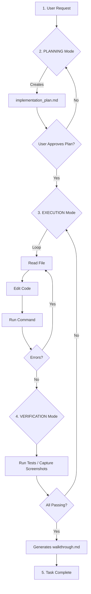

# The Antigravity Codex
> *Mastering the Art of Agentic Development with Google Antigravity — The Definitive Handbook.*

---

[](https://opensource.org/licenses/MIT)
[](#)
[](#)

## 📖 Project Overview

**The Antigravity Codex** is a comprehensive, professional-grade educational handbook for **Google Antigravity**, the agentic AI-powered Integrated Development Environment (AIDE) from Google. It is designed for developers, software engineers, team leads, and technical architects who want to understand, adopt, and master this paradigm-shifting platform.

This handbook goes beyond a simple feature list. It provides:
- **Deep technical explanations** of core concepts like agentic loops, task boundaries, and artifacts.
- **Architectural insights** into how Antigravity bridges AI reasoning with real-world development workflows.
- **Practical guidance** on getting started, best practices, and common pitfalls.
- **Honest comparisons** with other leading tools in the market.

**Tagline:** *"Your AI collaborator isn't just listening—it's building."*

---

## 📚 Table of Contents

1.  [Introduction: What is Google Antigravity?](#1-introduction-what-is-google-antigravity)
2.  [Core Concepts](#2-core-concepts)
    - [2.1. The Agent-First Paradigm](#21-the-agent-first-paradigm)
    - [2.2. AI Agents & Autonomy](#22-ai-agents--autonomy)
    - [2.3. Artifacts & Verification Workflows](#23-artifacts--verification-workflows)
    - [2.4. Editor View & Manager View](#24-editor-view--manager-view)
3.  [Key Features](#3-key-features)
4.  [How It Works: The Agentic Loop](#4-how-it-works-the-agentic-loop)
5.  [Supported AI Models & Integration](#5-supported-ai-models--integration)
6.  [Comparison with Other Tools](#6-comparison-with-other-tools)
7.  [Use Cases](#7-use-cases)
8.  [Benefits and Limitations](#8-benefits-and-limitations)
9.  [Getting Started & Installation](#9-getting-started--installation)
10. [Best Practices & Tips](#10-best-practices--tips)
11. [Common Misconceptions](#11-common-misconceptions)
12. [Future Directions](#12-future-directions)
13. [Glossary of Terms](#13-glossary-of-terms)
14. [References & Resources](#14-references--resources)
15. [Repository Structure & License](#15-repository-structure--license)

---

## 1. Introduction: What is Google Antigravity?

Google Antigravity is a **next-generation, AI-native Integrated Development Environment (AIDE)** officially launched in public preview on **November 18, 2025**. Developed by the **Google DeepMind team**, it is built as a fork of Visual Studio Code, making it immediately familiar to millions of developers while introducing a fundamentally new way of working.

At its heart, Antigravity replaces the traditional "human types, computer executes" model with an **agent-first paradigm**. You don't just write code *in* Antigravity; you **delegate tasks *to* Antigravity**.

### 🎯 The Core Promise

> Antigravity allows developers to offload complex, multi-step software engineering tasks—from debugging and refactoring to building entire features—to autonomous AI agents. The developer's role shifts from manual code production to **task orchestration, oversight, and review**.

The name "Antigravity" is a metaphor for the platform's goal: to remove the "weight" of mundane, repetitive, and boilerplate coding, allowing developer creativity and strategic thinking to rise.

---

## 2. Core Concepts

Understanding Antigravity requires grasping a few foundational ideas that distinguish it from all prior AI-assisted coding tools.

### 2.1. The Agent-First Paradigm

| Paradigm        | Interaction Model                                     | Context Persistence        |
| :-------------- | :---------------------------------------------------- | :-------------------------- |
| **Chat-First**  | User prompts, AI responds. User must drive every step. | Typically session-based.    |
| **Agent-First** | User assigns a *task*. AI plans, executes, and verifies. | Project and artifact-based. |

**Chat-First tools** (like ChatGPT, or basic Copilot Chat) are conversational. You ask, you receive. The context is often lost at the end of the session, and complex tasks require constant manual re-prompting.

**Agent-First tools** (like Antigravity) are *agentic*. You describe a high-level goal ("Refactor the authentication module to use JWT"), and the agent takes ownership. It creates a plan, writes code across multiple files, runs tests, and reports back. Its state is persisted in files within your project, so you can pause, resume, and even review the agent's "thought process" at any time.

### 2.2. AI Agents & Autonomy

The agent inside Antigravity is not merely a language model that generates text. It is an **autonomous software engineering agent** with access to a powerful suite of tools:

| Tool Category      | Examples of Capabilities                                                                 |
| :----------------- | :---------------------------------------------------------------------------------------- |
| **Filesystem**     | Read, write, and edit files across the entire repository.                                |
| **Terminal**       | Run shell commands: `npm install`, `pytest`, `docker build`, etc.                        |
| **Browser**        | Navigate to URLs, read documentation, interact with local web servers for UI validation. |
| **Web Search**     | Query the internet for API docs, Stack Overflow solutions, and library references.       |
| **Image Generation** | Create UI mockups, diagrams, or visual assets directly within the workflow.             |
| **Self-Tooling**   | Run linters, build scripts, and use the results to self-correct.                         |

This tool access is what enables the agent's **autonomy**. It does not just *suggest* code; it *writes* it, *runs* it, *checks* it, and *iterates* on it.

> [!IMPORTANT]
> **Human-in-the-Loop (HiTL):** Despite its autonomy, Antigravity is designed with guardrails. Critical actions (like running potentially destructive commands) require user approval. The agent proposes; the human approves.

### 2.3. Artifacts & Verification Workflows

Artifacts are the agent's **externalized memory and communication medium**. Instead of hiding its context in an opaque, volatile window, Antigravity writes its plans and progress to visible Markdown files within your project (typically in a `.gemini/` or `.agent/` directory).

| Artifact Type           | File Name                 | Purpose                                                                      |
| :----------------------- | :------------------------- | :--------------------------------------------------------------------------- |
| **Task List**            | `task.md`                 | A checklist (`- [ ]`, `- [x]`) tracking the sub-tasks of the current goal. |
| **Implementation Plan**  | `implementation_plan.md` | A technical design document detailing *what* will be changed and *how*.       |
| **Walkthrough**          | `walkthrough.md`          | A post-completion summary of what was done, including screenshots/recordings. |

**The Verification Workflow:**
This is not just "write and hope." Antigravity has a dedicated **VERIFICATION mode**. After executing code changes, the agent will:
1.  Run the test suite (e.g., `npm test`).
2.  Analyze the output for errors or failures.
3.  If tests pass, potentially capture a screenshot of the resulting UI (using the browser tool).
4.  Generate a `walkthrough.md` documenting the proof of work.

This creates an auditable trail of *what the agent did* and *how it was validated*.

### 2.4. Editor View & Manager View

Antigravity offers two primary interfaces to accommodate different stages of work:

| View           | Description                                                                                          |
| :------------- | :--------------------------------------------------------------------------------------------------- |
| **Editor View** | The familiar VS Code-like interface. Edit code, navigate files, use the integrated terminal. The agent lives in a sidebar chat panel here. |
| **Manager View** | A high-level, task-centric dashboard. It displays `TaskName`, `TaskStatus`, and `TaskSummary`. You use this view to **orchestrate and supervise** agents, potentially running multiple in parallel on different parts of a project. |

The Manager View is where the "agentic" nature of Antigravity becomes most apparent. Instead of reading lines of code, you're reading progress summaries like:
> **TaskName:** Implementing User Authentication
> **TaskStatus:** Running integration tests...
> **TaskSummary:** Created `AuthService.ts`, integrated with PostgreSQL, and added unit tests. 5 of 7 tests passing.

---

## 3. Key Features

### ⚡ Agentic Mode
The core engine. When you issue a request, the agent enters a loop of **PLANNING → EXECUTION → VERIFICATION**. It handles the back-and-forth of researching, coding, and testing until the task is complete or it hits a blocker that requires human input.

### 🗂️ Persistent Artifacts
Unlike ephemeral chat history, all plans and summaries are saved as `.md` files. You can:
- Review them in Git diffs.
- Share them with teammates for code reviews.
- Use them as training data for future agents.

### 🖥️ Integrated Browser
The agent can launch and control a headless browser. This allows it to:
- Look up documentation.
- Preview local `http://localhost:3000` applications.
- Take screenshots of UI components to verify visual correctness.
- Record browser interactions as videos for walkthroughs.

### 🔄 Self-Improvement & Memory
Agents can learn from past work. Useful snippets, patterns, and context can be saved to a "knowledge base" within the project. The next time you ask for something similar, the agent can reference its prior learning.

### 🧩 Multi-Model Support
While powered primarily by the **Gemini 3** family, Antigravity supports connecting to other models:
- Anthropic **Claude Sonnet 4.5** / **Claude Opus 4.5**
- Open-source variants like **GPT-OSS-120B**

This allows teams to choose the best model for their specific use case or budget.

---

## 4. How It Works: The Agentic Loop

The following diagram illustrates the typical workflow when you assign a task to Antigravity:



### Step-by-Step Breakdown:

1.  **Initiation:** You describe a goal in natural language: *"Add a dark mode toggle to the settings page."*
2.  **Planning:** The agent searches the codebase, identifies relevant files (`Settings.tsx`, `theme.css`), and writes an `implementation_plan.md` detailing the proposed changes. It then asks for your approval.
3.  **Execution:** Upon approval, the agent iterates. It edits files, potentially installs new dependencies (`npm install classnames`), and checks for linting errors after each change.
4.  **Verification:** The agent runs the designated test suite. If tests fail, it loops back to execution to fix the issue. If a UI is involved, it may launch a browser, navigate to the settings page, click the toggle, and take a "before" and "after" screenshot.
5.  **Completion:** A `walkthrough.md` is generated summarizing the changes, including embedded screenshots. The agent notifies you that the task is complete and ready for final human review.

---

## 5. Supported AI Models & Integration

Google Antigravity is powered by the **Gemini 3** family of models, developed by Google DeepMind.

| Model                | Strengths                                                                       | Primary Use Case                           |
| :------------------- | :------------------------------------------------------------------------------ | :----------------------------------------- |
| **Gemini 3 Pro**     | Best overall balance of reasoning, speed, and cost. Up to 2M token context.     | General agentic coding, large codebases.   |
| **Gemini 3 Deep Think** | Enhanced multi-step reasoning and planning. "Thinks" before it acts.            | Complex refactoring, architecture design. |
| **Gemini 3 Flash**   | Fastest response time, lower cost.                                              | Quick edits, autocomplete, simple tasks.  |

### Multi-Model Flexibility
Antigravity also allows integration with third-party models for specific tasks or team preferences:
- **Anthropic Claude (Sonnet 4.5 / Opus 4.5):** Known for strong instruction following and safety.
- **GPT-OSS-120B:** An open-source model option for teams with data residency or customization requirements.

---

## 6. Comparison with Other Tools

The AI coding assistant market is competitive. Here's how Antigravity stacks up against the major players:

| Feature                  | **Google Antigravity**             | GitHub Copilot                    | Cursor                            | Aider                              | Windsurf (Codeium)                |
| :----------------------- | :--------------------------------- | :-------------------------------- | :-------------------------------- | :---------------------------------- | :-------------------------------- |
| **Type**                 | AI-Native AIDE                     | IDE Extension + Agent             | AI-Native IDE (VS Code fork)      | CLI Tool + IDE integration          | AI-Native IDE                     |
| **Primary Paradigm**     | ⭐ **Agent-First (Task Autonomy)** | Assist-First (Suggestions)        | Hybrid (AI-First IDE)             | Hybrid (Agentic CLI)                | Agent-First (Cascade System)      |
| **Codebase Context**     | Full repository + artifacts        | Open files/repos                  | Full codebase                     | Full Git repository                 | Full project                      |
| **Tool Use (Terminal/Browser)** | ⭐ **Full (Native)**             | Limited via Agent                 | Limited (Terminal)                | Terminal only                       | Terminal                          |
| **Planning Artifacts**   | ⭐ **Explicit (`implementation_plan.md`)** | Implicit                          | Implicit                          | Implicit (Git commits)              | Implicit (Cascade rules)          |
| **Self-Verification**    | ⭐ **Native (Screenshots, Tests)** | Manual                            | Manual                            | Can run tests                       | Manual / Auto-fix loops           |
| **Pricing**              | Free (Public Preview)              | Subscription                      | Free tier + Paid                  | Open-Source / Free                  | Free tier + Paid                  |
| **Model Support**        | Gemini 3, Claude, GPT-OSS          | OpenAI GPT-4o, Claude             | GPT-4, Claude                     | Flexible (Any LLM)                  | Proprietary + Others              |

### Summary of Differentiators:
- **Antigravity's unique strength** is the combination of **explicit planning artifacts** (`implementation_plan.md`), **native browser tooling** (for UI verification), and a **structured agentic loop** (PLANNING → EXECUTION → VERIFICATION). This makes it the most "managed" agentic experience.
- **Cursor** is a strong competitor as an AI-first IDE but lacks Antigravity's formal artifact and verification system.
- **Aider** is excellent for developers who prefer a CLI-centric, open-source workflow but doesn't have the integrated browser or UI-focused features.
- **Copilot** is the most mature and widely deployed but is fundamentally still an "assist" tool, not a true "agent" in the same autonomous sense.

---

## 7. Use Cases

Antigravity shines in scenarios that require multi-step, cross-file changes where the cost of manual implementation is high.

| Use Case                     | Example Request                                                                                  |
| :---------------------------- | :----------------------------------------------------------------------------------------------- |
| 🏗️ **Greenfield Development** | "Scaffold a complete Next.js 15 application with Tailwind, Supabase auth, and a basic dashboard." |
| ♻️ **Large-Scale Refactoring** | "Migrate this entire Python 2 codebase to Python 3, updating all dependencies."                   |
| 🐛 **Debugging & Fixing**       | "Run the test suite, identify the failing test in `user_auth_test.py`, and fix the race condition." |
| 📝 **Documentation Generation** | "Analyze all source files and generate a comprehensive `README.md` with API examples."           |
| 🔒 **Security Patching**        | "Audit `package.json` for known vulnerabilities and update all affected packages."                |
| 🎨 **UI/UX Implementation**     | "Implement the new onboarding flow based on the Figma designs linked here. Take screenshots of each step." |

---

## 8. Benefits and Limitations

### ✅ Benefits

| Benefit                        | Description                                                                                                                               |
| :----------------------------- | :---------------------------------------------------------------------------------------------------------------------------------------- |
| **10x Productivity Potential** | Offload entire implementation cycles. A task that takes a developer hours can be completed in minutes of agent runtime.                   |
| **Reduced Context Switching**  | The agent searches documentation, reads Stack Overflow, and references APIs so you don't have to leave the IDE.                          |
| **Full Repository Awareness**  | The agent understands the *entire* project structure, not just the currently open file, leading to more coherent multi-file changes.       |
| **Auditable Work Trail**       | Every plan (`implementation_plan.md`) and summary (`walkthrough.md`) is a permanent, reviewable artifact in your Git history.               |
| **Lower Barrier for New Codebases** | Jump into an unfamiliar project. Ask the agent to explain it, then ask it to make changes. The onboarding time shrinks dramatically.       |

### ⚠️ Limitations

| Limitation                     | Description                                                                                                                               |
| :----------------------------- | :---------------------------------------------------------------------------------------------------------------------------------------- |
| **Verification Latency**       | Autonomous loops take time. Unlike instant autocomplete, a complex task might take several minutes as the agent iterates.                 |
| **Human Review is Non-Negotiable** | The agent is a powerful *partner*, not a *replacement*. You **must** review its plans and code. Blindly approving is a recipe for bugs. |
| **Learning Curve**             | The "agentic" mental model is new. Developers used to Chat-First tools may initially over-prompt or under-delegate.                        |
| **Resource Consumption**       | Running multiple agents, especially with long context windows, can be computationally intensive and may incur costs beyond the free tier. |
| **Edge Case Failures**         | Complex, novel problems may still require human creativity. The agent is best at patterns it has seen before.                              |

---

## 9. Getting Started & Installation

### System Requirements
- **OS:** Windows 10+, macOS 11+, Linux (Ubuntu 20.04+ recommended)
- **RAM:** 8 GB minimum, 16 GB recommended
- **Storage:** 500 MB for the IDE, plus space for your projects

### Installation Steps

1.  **Download:** Visit the official Antigravity website: `https://antigravity.google/` and download the installer for your OS.
2.  **Install:** Run the installer. On Windows, this is a standard `.exe` setup. On macOS, drag the `.app` to your Applications folder. On Linux, use the provided `.deb` or `.rpm` package.
3.  **Launch:** Open Antigravity from your applications menu. On first launch, you will be prompted to sign in with your Google account.
4.  **Authenticate:** Sign in to enable access to the Gemini 3 models. During the public preview, this is free with generous rate limits.
5.  **Open a Workspace:** Open an existing project folder or create a new one.
6.  **Your First Task:** Open the agent panel (usually via `Ctrl+Shift+P` or `Cmd+Shift+P` and searching "Antigravity: Open Chat") and type your first request!

```bash
# Example: Cloning a project and opening it
git clone https://github.com/your-org/your-project.git
cd your-project
antigravity .  # If CLI is installed
```

---

## 10. Best Practices & Tips

> [!TIP]
> Mastering Antigravity is about learning to *delegate effectively*. These tips will accelerate your journey.

### 📝 Be Specific in Your Requests
❌ **Weak:** "Fix the bug."
✅ **Strong:** "Fix the `NullPointerException` occurring in `UserService.java` at line 45 when a user attempts to log in with an empty email field."

### 📄 Review the Implementation Plan *Carefully*
The `implementation_plan.md` is your checkpoint. It costs nothing to revise a *plan*. It costs time and effort to revert *code*. If something looks off, ask the agent to revise the plan before proceeding.

### 🛠️ Use Task Boundaries for Complex Goals
Break down large objectives. Instead of asking for an entire feature in one shot, guide the agent:
1.  "First, create the database schema for the `Orders` feature."
2.  "Now, implement the backend API endpoints."
3.  "Finally, build the frontend components."

This gives you more control and makes each step easier to review.

### 🔄 Iterate, Don't Micromanage
If the agent's first attempt isn't perfect, **give feedback** rather than taking over. Say: "The implementation looks good, but the button should be on the left, not the right. Please adjust." The agent learns from your corrections.

### 🗃️ Leverage the Knowledge Base
If you have project-specific conventions (e.g., "All API responses must follow this JSON structure"), save them as rules or notes in the agent's knowledge base. It will reference these in future tasks.

---

## 11. Common Misconceptions

| Misconception                                  | Reality                                                                                                                               |
| :--------------------------------------------- | :------------------------------------------------------------------------------------------------------------------------------------- |
| *"It's just fancy autocomplete."*              | **False.** Autocomplete suggests the *next few characters*. Antigravity plans and executes *entire features* across multiple files. |
| *"It will replace software engineers."*        | **False.** It's a **force multiplier**. A senior engineer with Antigravity is more productive, but judgment, design, and review are still human responsibilities. |
| *"It can't actually run code."*                | **False.** The agent has **full terminal access** (with permission) and can run builds, tests, and any CLI command.                     |
| *"The AI knows everything about my project."* | **Partially True.** It has a large context window, but performance degrades on extremely massive monorepos. Strategic context management is still helpful. |
| *"I can just approve everything blindly."*     | **DANGEROUS.** The agent is probabilistic. Errors *will* occur. Review is not optional; it is a core part of the workflow.              |

---

## 12. Future Directions

Google has outlined an ambitious roadmap for Antigravity's evolution:

| Feature                        | Description                                                                                                |
| :----------------------------- | :--------------------------------------------------------------------------------------------------------- |
| **Multi-Agent Orchestration**  | Deploy specialized agents (e.g., a "Database Agent," a "Frontend Agent," a "DevOps Agent") that collaborate on complex projects. |
| **Native Cloud Deployment**    | One-click deployment to Google Cloud Platform (Cloud Run, Cloud Functions, GKE) directly from the IDE.    |
| **Self-Healing Repositories**  | Agents that run nightly CI/CD pipelines, automatically detecting and patching dependency vulnerabilities.   |
| **Real-time Collaboration**    | Multiple developers and agents working in the same codebase simultaneously, like a supercharged "Google Docs for Code." |
| **Enhanced Model Customization** | Fine-tuning Gemini models on your private codebase for even more accurate, context-aware suggestions.       |

---

## 13. Glossary of Terms

| Term                  | Definition                                                                                                |
| :-------------------- | :-------------------------------------------------------------------------------------------------------- |
| **AIDE**              | Agentic Integrated Development Environment. A new category of IDE where AI agents are first-class citizens. |
| **Agent**             | An autonomous AI system with access to tools (filesystem, terminal, browser) that can plan and execute complex tasks. |
| **Agentic Mode**      | The state where the agent is actively looping through its tools to solve a user-defined task.               |
| **Artifact**          | A persistent file (usually Markdown) created by the agent to store state, plans, or summaries.             |
| **Ephemeral Message** | A system message visible only to the agent (not the user), used for internal reminders or state info.      |
| **HiTL**              | Human-in-the-Loop. A design pattern where critical agent actions require explicit human approval.          |
| **Implementation Plan** | An artifact (`implementation_plan.md`) outlining the proposed technical changes before execution.        |
| **Manager View**      | The high-level, task-centric dashboard for supervising agents and their progress.                           |
| **Task Boundary**     | A marker indicating the start or end of a distinct unit of work. Used by the agent to structure its workflow. |
| **Walkthrough**       | An artifact (`walkthrough.md`) summarizing completed work, often with embedded screenshots or recordings.  |

---

## 14. References & Resources

### Official Resources
- **Google Antigravity Official Site:** [https://antigravity.google/](https://antigravity.google/)
- **Google Blog Announcement:** [https://blog.google/technology/google-labs/antigravity-ide-launch/](https://blog.google/technology/google-labs/antigravity-ide-launch/)
- **Antigravity Help Center:** [https://antigravityide.help/](https://antigravityide.help/)

### Related Google AI Technologies
- **Google DeepMind - Gemini:** [https://deepmind.google/technologies/gemini/](https://deepmind.google/technologies/gemini/)
- **Gemini Code Assist:** [https://codeassist.google/](https://codeassist.google/)
- **Gemini API for Developers:** [https://ai.google.dev/](https://ai.google.dev/)

### Industry Context
- **The New Stack - Antigravity Analysis:** [https://thenewstack.io/google-antigravity-agentic-ide-analysis/](https://thenewstack.io/google-antigravity-agentic-ide-analysis/)
- **Towards AI - Agent-First Development:** [https://towardsai.net/p/artificial-intelligence/agent-first-development-paradigm](https://towardsai.net/p/artificial-intelligence/agent-first-development-paradigm)

---

## 15. Repository Structure & License

### Suggested Repository Structure

For projects using Antigravity, consider this layout:

```
my-project/
├── .antigravity/                   # Antigravity's "brain" directory (or .gemini/)
│   ├── task.md                     # Current task checklist
│   ├── implementation_plan.md      # Active plan (user-reviewed)
│   ├── walkthrough.md              # Completion summaries
│   └── knowledge/                  # Saved context, snippets, and rules
│       ├── api_conventions.md
│       └── style_guide.md
├── src/                            # Your source code
├── tests/                          # Your test suites
├── docs/
│   └── HANDBOOK.md                 # <-- This file! (The Antigravity Codex)
├── .gitignore                      # Add .antigravity/knowledge/ if contents are sensitive
├── package.json                    # Or pyproject.toml, go.mod, etc.
└── README.md
```

> [!NOTE]
> The `.antigravity/` directory (or `.gemini/`) is typically safe to commit to your repo. `task.md` and `implementation_plan.md` can serve as excellent documentation of the work that was done and the design decisions behind it. However, review contents before committing to avoid accidentally checking in sensitive context.

---

### License

This handbook, **The Antigravity Codex**, is released under the **MIT License**.

```text
MIT License

Copyright (c) 2025 The Antigravity Codex Contributors

Permission is hereby granted, free of charge, to any person obtaining a copy
of this software and associated documentation files (the "Software"), to deal
in the Software without restriction, including without limitation the rights
to use, copy, modify, merge, publish, distribute, sublicense, and/or sell
copies of the Software, and to permit persons to whom the Software is
furnished to do so, subject to the following conditions:

The above copyright notice and this permission notice shall be included in all
copies or substantial portions of the Software.

THE SOFTWARE IS PROVIDED "AS IS", WITHOUT WARRANTY OF ANY KIND, EXPRESS OR
IMPLIED, INCLUDING BUT NOT LIMITED TO THE WARRANTIES OF MERCHANTABILITY,
FITNESS FOR A PARTICULAR PURPOSE AND NONINFRINGEMENT. IN NO EVENT SHALL THE
AUTHORS OR COPYRIGHT HOLDERS BE LIABLE FOR ANY CLAIM, DAMAGES OR OTHER
LIABILITY, WHETHER IN AN ACTION OF CONTRACT, TORT OR OTHERWISE, ARISING FROM,
OUT OF OR IN CONNECTION WITH THE SOFTWARE OR THE USE OR OTHER DEALINGS IN THE
SOFTWARE.
```

---

<p align="center">
  <b>🚀 Happy Agentic Coding! 🚀</b>
</p>
<p align="center">
  <i>Built with knowledge, verified with tests, documented with artifacts.</i>
</p>
